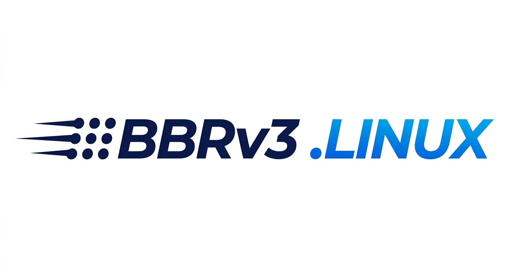

<p align="center">
  
</p>

🌏 **언어:** [简体中文](README.md) | [English](README_EN.md) | [日本語](README_JA.md) | **한국어**

Debian/Ubuntu VPS용 BBRv3 커널 설치 및 네트워크 가속 관리 프로그램입니다.

이 프로젝트는 [byJoey/Actions-bbr-v3](https://github.com/byJoey/Actions-bbr-v3)의 **Go + [bubbletea](https://github.com/charmbracelet/bubbletea) TUI 재작성 버전**입니다:

- 기존 shell 기반 `install.sh`를 Go 프로그램으로 다시 작성했으며, **기능과 옵션이 완전히 동일**합니다(대화형 메뉴, 보안 완화, `bbr` 빠른 명령).
- 브랜드 식별자를 `joeyblog`에서 `MinimaxFlora`로 교체했습니다(커널 패키지 이름, 설정 경로, 제거 매칭, MODULE_DESCRIPTION).
- 커널 `.deb` 패키지는 이 저장소의 GitHub Releases에서 다운로드합니다.

## 사용 방법

```bash
# 원클릭 설치 및 실행(아키텍처 자동 감지, 최신 바이너리 다운로드 후 시작)
bash <(curl -fsSL https://raw.githubusercontent.com/MinimaxFlora/Linux-BBR-v3/master/install.sh)
```

첫 실행 후 프로그램이 `bbr` 빠른 명령을 자동으로 설치합니다. 이후에는 바로 실행할 수 있습니다:

```bash
bbr
```

`bbr` 명령은 로컬에 설치된 버전을 직접 실행하며, 매번 네트워크에서 다운로드하지 않습니다. 업데이트는 TUI 메뉴 10「TUI 업데이트 확인」을 사용하세요.

root로 실행하면 먼저 다음을 수행합니다:

1. `/usr/local/bin/bbr` 빠른 명령 설치(현재 바이너리를 로컬에 복사한 뒤 직접 실행).
2. Dirty Frag 위험 표면 축소 규칙 작성(`/etc/modprobe.d/99-minimaxflora-security.conf`).

그런 다음 대화형 메뉴로 진입합니다.

## 지원 환경

| 항목 | 요구 사항 |
| --- | --- |
| 최소 지원 OS | Ubuntu 24.04+ / Debian 12+ |
| 권장 OS | Ubuntu 24.04+ / Debian 12+ |
| 패키지 매니저 | `apt-get` |
| 아키텍처 | `x86_64` / `aarch64` |
| 부트로더 | GRUB 권장 |
| 사용 시나리오 | VPS / 클라우드 서버 / 독립 서버 |

Raspberry Pi, NanoPi 등 U-Boot 또는 제조사 맞춤 커널 체인에 의존하는 기기에서는 사용을 권장하지 않습니다.

Debian testing/unstable에서 `VERSION_ID`가 없는 경우 `VERSION_CODENAME`을 기준으로 `bookworm`, `trixie`, `forky`, `sid`를 판별합니다. Alpine Linux는 현재 지원하지 않습니다(릴리스 산출물이 `.deb` 형식).

이 프로젝트의 현재 커널 메인라인은 Linux 7.x입니다. 커널 설치 시 최소 지원 OS보다 오래된 환경은 차단하여 kernel panic을 방지합니다. 오래된 OS에서도 상태 확인, 네트워크 튜닝, 최적화 초기화, 제거 기능은 사용할 수 있습니다.

## 메뉴

```text
 1. 🚀 BBR v3 설치 또는 업데이트(최신 버전)
 2. 📚 특정 버전 설치
 3. 🔍 BBR v3 상태 확인
 4. ⚡ BBR 가속 모드 활성화(FQ / FQ_CODEL / FQ_PIE / CAKE 하위 메뉴)
 5. 🌏 아시아 태평양 머신 TCP 튜닝
 6. 🗑️ BBR 커널 제거
 7. 🧠 BBR v3 스마트 대역폭 최적화
 8. 🧹 네트워크 최적화 설정 초기화
 9. 🧨 BBR v3 매니악 모드(극한 속도 테스트 챌린지)
10. 🔄 TUI 업데이트 확인
```

일반적인 흐름:

1. `1`을 선택해 BBRv3 커널을 설치하거나 업데이트하고, 안내에 따라 표준판 또는 Max 극한판을 선택합니다.
2. 안내에 따라 시스템을 재부팅합니다.
3. 다시 실행하여 `3`을 선택해 BBRv3 상태를 확인합니다.
4. `4`로 가속 모드 하위 메뉴에 들어가 FQ / FQ_CODEL / FQ_PIE / CAKE 중 선택합니다.
5. 아시아 태평양 회선 머신은 `5`로 TCP 송수신 창과 유휴 slow-start 튜닝을 적용합니다.
6. 회선 파라미터가 불확실하면 `7`로 자동 속도 측정 후 대역폭 구간에 따라 TCP 버퍼를 계산합니다.
7. 자체 회선의 극한 속도 테스트 챌린지에는 `9`로 공격적인 송신율 파라미터를 적용합니다.
8. 튜닝을 되돌리려면 `8`로 프로그램이 작성한 네트워크 최적화 설정을 초기화합니다.

## 커널 및 BBR 정책

```text
BBRv3 패치는 고정되어 있으며, 커널은 kernel.org의 최신 stable을 자동으로 따라갑니다.
```

현재 패치 선택 규칙:

```text
linux-7.0.y -> patches/bbrv3-linux-7.0.patch
linux-7.1.y -> patches/bbrv3-linux-7.1.patch
linux-7.2.y -> patches/bbrv3-linux-7.2.patch
```

커널 패키지는 GitHub Actions에서 빌드되어 Releases에 게시됩니다. 패키지 이름 예시(Debian 패키지 명명 규칙상 모두 소문자, `minimaxflora`는 브랜드 접미사):

```text
linux-headers-7.2.0-minimaxflora-bbrv3_7.2.0-1_amd64.deb        (표준판)
linux-headers-7.2.0-minimaxflora-bbrv3-max_7.2.0-1_amd64.deb    (Max판)
```

릴리스 태그 형식:

```text
x86_64-7.1.8
arm64-7.1.8
x86_64-7.1.8-max
arm64-7.1.8-max
```

Max판은 Startup, ProbeBW, cwnd 전략의 공격성을 높이지만, BBRv3의 loss, ECN, inflight, ProbeBW 피드백 루프는 유지합니다. 자체 회선의 처리량 테스트 전용이며, 일상적인 운영 환경에서는 권장하지 않습니다.

## BBRv3 상태 확인

`3`을 선택하면 다음을 확인합니다:

- `tcp_bbr` 모듈 버전이 `3`인지.
- 현재 TCP 혼잡 제어 알고리즘이 `bbr`인지.
- Dirty Frag 관련 모듈 블랙리스트가 작성되어 있는지.

## 가속 모드

`4`를 선택하면 가속 모드 하위 메뉴로 들어갑니다:

| 옵션 | 구성 |
| --- | --- |
| 1 | BBR + FQ(권장, 공정 큐) |
| 2 | BBR + FQ_CODEL(저지연) |
| 3 | BBR + FQ_PIE(비례 적분) |
| 4 | BBR + CAKE(케이크 큐) |

선택 즉시 적용을 시도하고, `/etc/sysctl.d/99-minimaxflora.conf`에 영구 저장할지 확인합니다.

프로그램은 `net.core.default_qdisc`를 작성할 뿐만 아니라, 현재 기본 경로 출구 NIC의 root qdisc를 선택한 알고리즘으로 즉시 교체합니다. 모듈 로드가 필요한 큐 알고리즘은 `/etc/modules-load.d/minimaxflora-qdisc.conf`에 기록됩니다.

## 아시아 태평양 머신 TCP 튜닝

`5`를 선택하면 즉시 적용되고 영구 저장됩니다:

```text
net.ipv4.tcp_wmem = 4096 16384 12582912
net.ipv4.tcp_rmem = 4096 131072 33554432
net.ipv4.tcp_limit_output_bytes = 4194304
net.ipv4.tcp_slow_start_after_idle = 0
```

## BBR v3 스마트 대역폭 최적화

`7`을 선택하면:

- 먼저 Ookla 공식 `speedtest 1.2.0`을 설치·실행하여 인근 테스트 서버를 자동 선택하고 업로드/다운로드 대역폭을 측정합니다. Python 버전 `speedtest-cli`가 감지되면 먼저 제거합니다. 측정 실패 시 업로드 대역폭을 수동 입력하도록 안내합니다. 테스트 노드의 지연은 숨겨지며 RTT 계산에 포함되지 않습니다.
- `bbr` 혼잡 제어와 `fq` 큐 알고리즘을 자동으로 활성화합니다.
- 업로드 대역폭과 지역 모드에 따라 권장 TCP 버퍼 구간을 매핑하고, 머신 메모리 기준으로 상한을 설정합니다.
- RTT는 사용자가 직접 입력합니다(v2rayN으로 측정한 실제 링크 지연). 아시아 태평양, 미주/유럽 자동 선택 또는 수동 RTT + 버퍼 구간을 선택할 수 있습니다.

## BBR v3 매니악 모드

`9`를 선택하면 `bbr` + `fq`를 강제 활성화하고 다음을 기록합니다:

```text
net.core.default_qdisc=fq
net.ipv4.tcp_congestion_control=bbr
net.core.rmem_max = 1073741824
net.core.wmem_max = 1073741824
net.core.optmem_max = 1073741824
net.core.netdev_max_backlog = 1000000
net.core.somaxconn = 65535
net.ipv4.tcp_wmem = 4096 1048576 1073741824
net.ipv4.tcp_rmem = 4096 1048576 1073741824
net.ipv4.tcp_limit_output_bytes = 268435456
net.ipv4.tcp_slow_start_after_idle = 0
net.ipv4.tcp_notsent_lowat = 4294967295
net.ipv4.tcp_autocorking = 0
net.ipv4.tcp_no_metrics_save = 1
net.ipv4.tcp_mtu_probing = 1
net.ipv4.tcp_fastopen = 3
net.ipv4.tcp_window_scaling = 1
net.ipv4.tcp_moderate_rcvbuf = 1
net.ipv4.tcp_ecn = 0
```

동시에 현재 기본 경로 출구 NIC의 런타임 `txqueuelen`을 `100000`으로 높입니다(영구 설정에는 기록하지 않음). 핵심 파라미터 적용 실패 시 중단되고, 보조 파라미터 실패는 차단하지 않습니다.

## 네트워크 최적화 설정 초기화

`8`을 선택하면 이 프로그램이 작성한 영구 설정(default_qdisc, 혼잡 제어, TCP 버퍼 전체 시리즈)을 정리하고 `/etc/modules-load.d/minimaxflora-qdisc.conf`를 삭제합니다. 네트워크 최적화 설정만 초기화하며, BBR 커널을 제거하지 않고 Dirty Frag 완화 규칙도 유지합니다. 런타임 파라미터는 재부팅 후에야 완전히 기본값으로 복원될 수 있습니다.

## 보안 완화

시작 시 `/etc/modprobe.d/99-minimaxflora-security.conf`를 작성합니다:

- `esp4` / `esp6` / `rxrpc` 블랙리스트(`blacklist` + `install /bin/false`)로 Dirty Frag 위험 표면을 축소합니다. 이미 로드된 모듈은 가능하면 언로드하며, 사용 중이면 재부팅 후 적용됩니다.

CVE-2026-31431에 해당하는 AEAD userspace 인터페이스는 새로 빌드된 커널에서 커널 설정 측면에서 축소되었으며(`# CONFIG_CRYPTO_USER_API_AEAD is not set`), 추가 `algif_aead` 블랙리스트는 작성하지 않습니다. 이전 버전에서 작성된 경우, 현재 실행 중인 커널에서 비활성화를 확인한 뒤 자동으로 제거합니다.

## 제거

`6`을 선택하면 이 프로젝트가 설치한 `MinimaxFlora` 커널 패키지를 제거하고 부트 설정을 갱신합니다. 제거 후 재부팅을 권장합니다.

## 빌드

로컬 빌드(Windows / macOS / Linux 모두 크로스 컴파일 가능):

```bash
# Linux amd64
CGO_ENABLED=0 GOOS=linux GOARCH=amd64 go build -trimpath -ldflags="-s -w" -o bbrv3-linux-amd64 .
# Linux arm64
CGO_ENABLED=0 GOOS=linux GOARCH=arm64 go build -trimpath -ldflags="-s -w" -o bbrv3-linux-arm64 .
```

개발 미리보기(시스템 검사를 건너뛰어 비 Linux 머신에서도 TUI 확인 가능):

```bash
BBRV3_DEV=1 go run .
```

테스트:

```bash
go test ./...
```

GitHub Actions의 `release-cli.yml` 워크플로(커널 빌드와 독립)는 master 푸시 또는 수동 트리거 시 바이너리를 빌드하여 `bbrv3-cli` 릴리스에 게시합니다. TUI 메뉴 10「TUI 업데이트 확인」이 여기서 최신 버전을 가져와 로컬 `bbr`을 교체합니다. `build.yml`은 커널 빌드와 릴리스만 담당합니다.

## 디렉터리 구조

```text
install.sh                      # 원클릭 스크립트: 아키텍처 감지 → 최신 바이너리 다운로드 → 실행
main.go                         # 진입점(비 root 시 sudo로 자동 재실행)
internal/
├── bbr/                       # 순수 로직: 버전 비교 / 태그 파싱 / 버퍼 계산(단위 테스트 가능)
├── execx/                     # 명령 실행기: 출력을 스트림으로 TUI 로그에 전달
├── system/                    # sysctl / qdisc / 보안 완화 / 네트워크 튜닝 / 커널 설치 / 빠른 명령
├── netutil/                   # GitHub release API + Ookla speedtest
└── app/                       # bubbletea TUI: 메인 메뉴 + 하위 페이지(폼 / 진행 로그 / 결과)
scripts/                       # 커널 빌드 스크립트(CI용, 상류와 동일, 패키지 이름 브랜드화 완료)
patches/                       # BBRv3 패치(고정)
configs/x86-64.config / arm64.config   # 커널 설정 베이스라인
.github/RELEASE_NOTES_cli.md   # bbrv3-cli 릴리스 설명(푸시할 때마다 자동 갱신)
.github/workflows/build.yml      # 커널 자동 빌드 + 릴리스(schedule / 수동 트리거)
.github/workflows/release-cli.yml # Go TUI 바이너리를 bbrv3-cli 릴리스에 게시(push master / 수동 트리거)
```

## 면책 조항

커널 업그레이드는 위험이 따릅니다. 설치 전에 VPS 콘솔, 복구 모드 또는 이전 커널 부팅 항목을 사용할 수 있는지 확인하세요. 이 프로젝트로 빌드하거나 설치한 커널로 인한 부팅 실패, 네트워크 이상, 데이터 손실은 사용자가 부담합니다.
